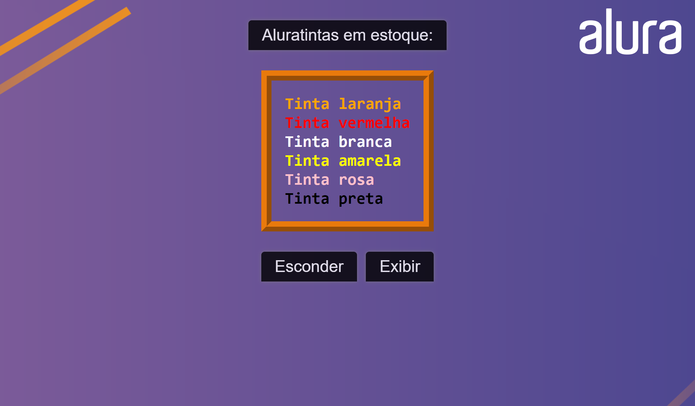

#Data-attribute

Criei funções para manipular elementos no DOM com data-attributes.

Criei um botão que ao ser clicado, faz a lista de cores sumir, e também criei um segundo botão que ao ser clicado faz, aparecer a lista novamente.
 
 

